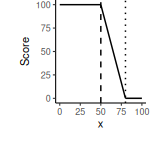
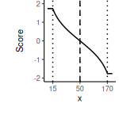
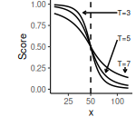

# About
This document comprises the manual for the Darwin Harbour Water
Quality monitoring program analysis application. It provides
information on:

- a broad overview of the structure of the application
- the application dependencies and how to install them
- starting the application
- progressing through the analysis pipeline
- visualising, interpreting and extracting outputs
 
# Structural overview

[R Graphical and Statistical Environment](https://www.r-project.org/)
offers an ideal platform for developing and running complex
statistical analyses as well as presenting the outcomes via
professional graphical/tabular representations. As a completely
scripted language it also offers the potential for both full
transparency and reproducibility. Nevertheless, as the language, and
more specifically the extension packages are community developed and
maintained, the environment evolves over time. Similarly, the
underlying operating systems and programs on which R and its extension
packages depend (hereafter referred to as the _operating environment_)
also change over time. Consequently, the stability and reproducibility
of R codes have a tendency to change over time.

## Docker containers

One way to attempt to future proof a codebase that must be run upon a
potentially unpredictable operating environment is to **containerise**
the operating environment, such that it is preserved to remain
unchanged over time. Containers (specifically
[docker](https://www.docker.com/) containers) are lightweight
abstraction units that encapsulate applications and their dependencies
within standardized, self-contained execution environments. Leveraging
containerization technology, they package application code, runtime,
libraries, and system tools into isolated units (_containers_) that
abstract away underlying infrastructure differences, enabling
consistent and predictable execution across diverse computing
platforms.

Containers offer several advantages, such as efficient resource
utilization, rapid deployment, and scalability. They enable developers
to build, test, and deploy applications with greater speed and
flexibility. Docker containers have become a fundamental building
block in modern software development, enabling the development and
deployment of applications in a consistent and predictable manner
across various environments.

## Shiny applications

[Shiny](https://shiny.posit.co/) is a web application framework for R
that enables the creation of interactive and data-driven web
applications directly from R scripts. Developed by
[Rstudio](https://posit.co/), Shiny simplifies the process of turning
analyses into interactive web-based tools without the need for
extensive web development expertise.

What makes Shiny particularly valuable is its seamless integration
with R, allowing statisticians and data scientists to build and deploy
bespoke statistical applications, thereby making data visualization,
exploration, and analysis accessible to a broader audience. With its
interactive and user-friendly nature, Shiny serves as a powerful tool
for sharing insights and engaging stakeholders in a more intuitive and
visual manner.
## Git and github

Git, a distributed version control system, and
[GitHub](https://github.com/), a web-based platform for hosting and
collaborating on Git repositories, play pivotal roles in enhancing
reproducibility and transparency in software development. By tracking
changes in source code and providing a centralized platform for
collaborative work, Git and GitHub enable developers to maintain a
detailed history of code alterations. This history serves as a
valuable asset for ensuring the reproducibility of software projects,
allowing users to trace and replicate specific versions of the
codebase.

GitHub Actions (an integrated workflow automation feature of GitHub),
automates tasks such as building, testing, and deploying applications
and artifacts. Notably, through workflow actions, GitHub Actions can
build docker containers and act as a container registry. This
integration enhances the overall transparency of software development
workflows, making it easier to share, understand, and reproduce
projects collaboratively.

@fig-diagram provides a schematic overview of the relationship
between the code produced by the developer, the Github cloud
repositiory and container registry and the shiny docker container run
by user.


::: {.cell}
::: {.cell-output-display}
{#fig-diagram width=576}
:::
:::

# Installation

## Installing docker desktop

To retrieve and run docker containers requires the installation of
[Docker Desktop](https://www.docker.com/products/docker-desktop/) on
Windows and MacOSx

### Windows

The steps for installing Docker Desktop are:

- **Download the Installer:** head to
  <https://docs.docker.com/desktop/install/windows-install/> and follow
  the instructions for downloading the appropriate installer for your
  Windows version (Home or Pro).

- **Run the Installer:** double-click the downloaded file and follow
  the on-screen instructions from the installation wizard. Accept the
  license agreement and choose your preferred installation location.

- **Configure Resources (Optional):** Docker Desktop might suggest
  allocating some system resources like CPU and memory. These settings
  can be adjusted later, so feel free to use the defaults for now.

- **Start the Docker Engine:** once installed, click the "Start Docker
  Desktop" button. You may see a notification in the taskbar - click
  it to confirm and allow Docker to run in the background.

- **Verification:** open a terminal (or Powershell) and run `docker --version`. 
  If all went well, you should see information about the
  installed Docker Engine version.

Additional Tips:

- Ensure Hyper-V (virtualization) is enabled in your BIOS settings for optimal
  performance.


## Installing the and running the app

The task of installing and running the app is performed via a single
**deploy script** (`deploy_wq.bat` on Windows or `deploy_wq.sh` on
Linux/MacOSX/wsl). For this to work properly, the deploy script should
be placed in a folder along with two additional folders (one called
`input` and the other called `parameters`) that contains the input
datasets (in csv format) and run time parameters. This structure is
illustrated below for Windows.

```
\
|- deploy_wq.bat
|- input
   |- 16_wq.csv
   |- 17_wq.csv
   |- overwrites.csv
   |- weights_m.csv
   |- weights_s.csv
|- parameters
   |- config.ini
   |- water_quality_guidelines.csv
   |- spatial.csv
   |- GIS
      |- RCZ_rev24.*
      |- SBZone_upper.*
      |- Middle_Harbour_Upper.*
```

::: {.callout-note}
In the above illustration, there are two example water quality
datasets (`16_wq.csv` and `17_wq.csv`). To ensure that the application
correctly identifies them as water quality datasets, it is important
that they are named according to the following format: `<yy>_wq.csv`
where the `<yy>` represents a two digit year (e.g. 16 for 2016). For
additional information on the contents of these files, please see
@sec-data-requirements.
:::

To set up the above structure:

1. create a new folder on your computer in a location of your choice
   that you are likely to remember and easily locate (e.g. on the
   desktop). Whilst the name of the folder is not important, it is
   recommended that it be named after the project (e.g.
   `darwin_harbour_wq_monitoring`).

2. download the deploy script from the projects github repository

   a. go to the projects github repository
      (<https://github.com/open-AIMS/dh_wq_monitoring.git>) in a
      browser

   b. click on either the `deploy_wq.bat` (Windows) or `deploy_wq.sh`
      (Linux/MacOSX/wsl).

      

   c. click on the download button and select the project folder as
      the location to download the file to. If the file is
      automatically downloaded to a downloads folder, move the file to
      the project folder.

      

3. within the project folder, create folders called `inputs` and
   `parameters` (as outlined above) and place all the appropriate data
   sets into these folders

To run the app, navigate inside of the project folder and run
(typically double click) on the deploy script. Upon doing so, you will
be presented with a directory selection window that is prompting for
the path of the project folder. Navigate to and select the project
folder before clicking the "OK" button. Shortly thereafter, the
application will appear in a browser tab.

::: {.callout-note collapse=true}
## More specific information about the `deploy_wq.bat` script
The `deploy_wq.bat` script performs the following:

1. defines paths to the project repository and local project folder
2. checks if `docker` is installed and available from the command line
   for the current user
3. checks if `docker` is running
4. query the user for the location of the project folder
5. determine whether there are any updates to the `docker` image and
   if so pull them down
6. run the `docker` container
7. open the shiny app in a browser
:::
# The Darwin Harbour Water Quality Monitoring Program Analysis App

This [Shiny](https://shiny.posit.co/) application is designed to
ingest very specifically structured water quality datasets containing
Darwin Harbour Water Quality monitoring data and produce various analyses
and visualisations. The application is served from a
[docker](https://www.docker.com/) container to the localhost and the
default web browser.

Docker containers can be thought of a computers running within other
computers. More specifically, a container runs an instance of image
built using a series of specific instructions that govern the entire
software environment. As a result, containers run from the same image
will operate (virtually) identically regardless of the host
environment. Furthermore, since the build instructions can specify
exact versions of all software components, containers provide a way of
maximising the chances that an application will continue to run as
designed into the future despite changes to operating environments and
dependencies.

This shiny application comprises five pages (each accessable via the
sidebar menu on the left side of the screen):

1. a **Landing** page (this page) providing access to the settings and
   overall initial instructions
2. a **Dashboard** providing information about the progression of
   tasks in the analysis pipeline
3. a **Data** page providing overviews of data in various stages
4. a **QAQC** page providing graphical QAQC outputs
5. a **Summaries** page providing summaries of the bootstrap
   aggregation of indices
6. a **Manual** page that displays the online manual for the
   application

Each page will also contain instructions to help guide you through
using or interpreting the information. In some cases, this will take
the from of an info box (such as the current box). In other cases, it
will take the form of little <span class="fas fa-circle-info"></span>
symbols whose content is revealed with a mouse hover.

There are numerous stages throughout the analysis pipeline that may
require user review (for example examining any data validation issues
as well as the QAQC figures to confirm that the data are as expected).
Consequently, it is advisable for the user to manually trigger each
successive stage of the pipeline. The stages are:

- Stage 1 - Prepare environment 
  <details><summary>More info</summary>
  <p class = "details-info">
  This stage is run automatically on startup and essentially sets up the operating environment.
  
  - load any R package dependencies
  - get runtime settings from `../params/config.ini`.
    These include:
    - `focal_year`: usually the final year of sampling, all artifacts
       (data/graphics) will be stored in a folder reflecting this year
    - `method`: the index method to apply when calculating indices
    - `foldcap`: the folding cap to apply when calculating indices
    - `tuning`: the tuning to apply when calculating indices
    - `size`: the number of bootstrapp samples
    - `seed`: the random seed to apply to bootstrapping
  </p> </details>
- Stage 2 - Obtain data
  <details><summary>More info</summary>
  <p class = "details-info">
  This stage comprises of the following steps:
  
  - read in the water quality guidelines from
    `../parameters/water_quality_guidelines.csv`.
  - read in each of the water quality data files from `../input/`.
    These files are in the format of `<number>_wq.csv`, where
    `<number>` is a two digit number representation of the sampling
    year.
  - read in each of the overwrites file from
    `../input/overwrites.csv`.
  - read in each of the measures weights file from
    `../input/weights_m.csv`.
  - read in each of the spatial weights file from
    `../input/weights_s.csv`.
  - read in the aggregation hierarchy file from
    `../input/hierarchy.csv`.
  - read in the spatial settings file from
    `../parameters/spatial.csv`.
  - validating each of the sources of input data according to a set of
    validation rules
  
  The tables within the **Raw data** tab of the **Data** page will
  also be populated (but wont be available for review until after the
  data have been processed in Stage 3). 
  </p> </details>
- Stage 3 - Prepare spatial data
  <details><summary>More info</summary>
  <p class = "details-info">
  This stage comprises of the following steps:
 
  - read in individual shapefiles from `../parameters/GIS`.  The files are:
    - `RCZ_rev24.shp`
    - `SBZone_upper.shp`
    - `Middle_Harbour_Upper.shp`
  - combine all shapefiles into a single shapefile
  
  The tables within the **Processed data** tab of the **Data** page will also be populated.
  </p></details>
- Stage 4 - Process data
  <details><summary>More info</summary>
  <p class = "details-info">
  This stage comprises of the following steps:
 
  - combine all the water quality data into a single data set
  - process the dates from strings into genuine date objects
  - filter data to the bounds either defined in
    `../parameters/config.ini` or the data
  - select only measures for which there are guideline values
  - if the `focal_year` is undefined, define it based on the maximum date
  - pivot the data into a longer format that is more suitable for
    analysis and graphing
  - join in the guidelines information
  - use the spatial information in the shapefiles to assign spatial
    domains such as Regions and Zones.
  - apply any unit conversions to the values
  - apply limit of detection rules (to Dissolved Oxygen)
  - join in the aggregation hierarchy
  
  The tables within the **Processed data** tab of the **Data** page will also be populated and the `Data` page will be available for review.
  </p>
  </details>
- Stage 5 - Calculate indices
  <details><summary>More info</summary>
  <p class = "details-info">
  This stage comprises of the following steps:
  
  - retrieve the processed data.
  - calculate the indices
  - prepare for bootstrapping
  
  </p>
  </details>
- Stage 6 - QAQC
  <details><summary>More info</summary>
  <p class = "details-info">
  This stage comprises of the following steps:
  
  - retrieve the processed data.
  - construct outlier plots
  - contruct an LOR table
  - contruct boxplots for each Measure for the Focal Year for each
    Zone
  - construct timeseries boxplots for each Measure/Zone
  - construct boxplots for each Measure for the Focal Year conditional
    on Zone
  
  The QAQC figures of the **QAQC** page will also be populated.
  </p>
  </details>
- Stage 7 - Bootstrapping
  <details><summary>More info</summary>
  <p class = "details-info">
  This stage comprises of the following steps:
  
  - generate bootsrapping schematic diagram
  - retrieve the processed data
  - retrieve the indices
  - process the overwrites
  - process the weights
  - aggregate to Zone/Measure/Source level
  - aggregate to Zone/Measure level
  - aggregate to Zone/Subindicator level
  - aggregate to Zone/Indicator level
  - aggregate to Region/Measure level
  - aggregate to Region/Subindicator level
  - aggregate to Region/Indicator level
  - aggregate to WH/Measure level
  - aggregate to WH/Subindicator level
  - aggregate to WH/Indicator level

  </p> </details>
- Stage 8 - Summaries
  <details><summary>More info</summary>
  <p class = "details-info">
  This stage comprises of the following steps:
  
  - retrieve the processed data
  - compile all the indice scores
  - generate Zone/Measure/Source level
  - collate Zone/Measure level scores
  - collate Zone/Subindicator level scores
  - collate Zone/Indicator level scores
  - collate Region/Measure level scores
  - collate Region/Subindicator level scores
  - collate Region/Indicator level scores
  - collate WH/Measure level scores
  - collate WH/Subindicator level scores
  - collate WH/Indicator level scores
  - generate trend plots
  - calculate effects (between years)
  - generate effects plots

  The trend and effects figures of the **Summaries** page will also be populated.
  </p> </details>

Underneath the sidebar menu there are a series of buttons that control
progression through the analysis pipeline stages. When a button is
blue (and has a play icon), it indicates that the Stage is the next
Stage to be run in the pipeline. Once a stage has run, the button will
turn green. Grey buttons are disabled.

Clicking on button will run that stage (or stages in some cases).
While the stage is in progress, a popup will be displayed over the
buttons. This popup serves two purposes. Firstly, some tasks within
some stages are computationally intense and thus take some time to
perform. For such tasks, a progress bar will be displayed in the popup
to inform you of the progress through this task. Secondly, as some
stages/tasks are slow, it provides visual feedback about when a stage
has truly started and completed and prevents the temptation to
repeatedly click on a button when nothing appears to be happening.

Once a stage is complete, the button will change to either green
(success), yellow (orange) or red (failures) indicating whether
errors/warnings were encountered or not. If the stage was completed
successfully, the button corresponding to the next available stage
will be activated.

Sidebar menu items that are in orange font are active and clicking on
an active menu item will reveal an associated page. Inactive menu
items are in grey font. Menu items will only become active once the
appropriate run stage has been met. The following table lists the
events that activate a menu item.

<div class="table-minimal">

| Menu Item | Trigger Event |
|-----------|---------------|
| Landing   | Always active |
| Dashboard | Always active |
| Data      | After Stage 4 |
| QAQC      | After Stage 6 |
| Summaries | After Stage 8 |
| Manual    | Always active |

Note, it is also possible to make all menu and buttons active using
the **Run in sequence** toggle, however this should only be used if
the full sequence of stages has already been run and you are returning
to the analyses in a later session 
</div>


@fig-diagram2 provides a schematic overview of the sequence of
filesystem events that occur during the development, deployment and
running of this app.

1. the developed codebase is pushed to github and if necessary
  continuous integration (github actions) is triggered. The continuous
  integration will re-build and host a docker image as well as rebuild
  the manual.
2. when the client runs the `deploy_wq.bat` (or `deploy_wq.sh`) script, it
   will check whether docker is running and get input from the user
   about the location of the project directory.
3. github will be queried
   to discover if a new docker image is available. If so, then the new
   image will be pulled down locally and run (if docker is runnning). 
4. the docker container will be run and this will trigger git within
   the container to pull down the latest version of the codebase from
   github to a temporary repo in the container. As the container is
   starting up, it will mount the project folder so that its contents
   are available to the environment within container and outputs
   produced within the container are available to the host.
5. some of the files in the temporary repo will be copied to a folder
   within the project folder.
6. the shiny app will start up on `port 3838` of the localhost and
   this will be offered to the default browser.
7. as the shiny app progresses through each of the analysis stages,
   more data will be added to various folders of the project
   directory.


::: {.cell}
::: {.cell-output-display}
{#fig-diagram2 width=576}
:::
:::


::: {.callout-note collapse=false}
## Prior to starting the application
Before starting the application, it is important that you review the
following files:

- `../parameters/config.ini`. Specifically, review the following
  fields:
  - `focal_year=`: indicates the year that will be considered the
    focal sampling year. All outputs will be stored in a folder
    reflecting this display diagnostics for this the focal year is the
    most recent sampling year. Furthermore, many of the QAQC
    diagnostics pertain specifically to this focal year alone.
  - `method=`: indicates the index method to employ (see
    @sec-index-computation for more information).
  - `foldcap=`: indicates the value (on the fractional/fold scale) to
    cap indices (see @sec-index-computation for more information)
  - `tuning=`: indicates the tuning value used in specific index
    calculations (see @sec-index-computation for more information)
  - `size=`: indicates the number of bootstrapp aggregations to use
  - `seed`: indicates the random seed to use during any stoichastic
    process
  - `start_date`: the minimum date for analysed data. This allows the
    lower bound year of the data to be restricted (to omit earlier
    data if necessary). If this item is missing, the start_date will
    be determined from the observed data.
  - `end_date`: the maximum date for the analysed data. This allows
    the upper bound year of the data to be restricted (to omit later
    data if necessary). If this item is missing, the end_date will be
    determined from the observed data.
- `../parameters/water_quality_guidelines.csv`. This file defines the guideline
  values associated with each measure as well as the labels to be used
  in tables/figures.
- `../parameters/spatial.csv`.  This file defines the names used for Zones and Areas.
- `../input/overwrites.csv`. This file defines any expert overwrites
  that should be applied (in the event that the observed values are
  considered unrepresentative or unsuitable for some justifiable
  reason).
- `../input/weights_m.csv`. This file provides any specific weights
  that should be applied when aggregating items together on the
  Measure scale.
- `../input/weights_s.csv`. This file provides any specific weights
  that should be applied when aggregating items together on the
  spatial scale.
:::

# Analyses

Before describing the sequence of steps in the analysis pipeline, it
is necessary to outline the major conceptual phases of the analyses.

## Index computation {#sec-index-computation}

Water Quality indices (which are standardized measures of condition)
are typically expressed relative to a guideline (see Appendix
@sec-guidelines) or benchmark. Of the numerous
calculation methods available, those that take into account the
distance from the guideline (i.e. incorporate
_difference-to-reference_) rather than simply an indication of whether
or not a guideline value has been exceeded are likely to retain more
information as well as being less sensitive to small changes in
condition close to the guidelines.

The challenging aspect of distance (or amplitude) based index
methodologies is that what constitutes a large deviation from a
benchmark depends on the scale of the measure. For example, a
deviation of 10 units might be considered relatively large of
turbidity (NTU) or salinity (ppt), yet might be considered only minor
for the Total Nitrogen ($\mu g/L$). In order to combine a range of
such metrics together into a meaningful index, the individual scores
must be expressed on a common scale. Whilst this is automatically the
case for Binary compliance, it is not necessarily the case for
distance based indices.
	
@tbl-indexMethods describes and compares the formulations and
response curves of the Binary compliance method as well as a number of
amplitude (distance based) indexing methods.

The Modified Amplitude and Logistic Modified Amplitude are both based
on a base 2 logarithm of the ratio of observed values to the
associated be benchmark (see @tbl-indexMethods). This scale ensures
that distances to the benchmark are symmetric (in that a doubling and
halving equate to the same magnitude - yet apposing sign).
Furthermore, the logarithmic transformation does provide some inbuilt
capacity to accommodate log-normality (a common property of measured
values).

By altering the sign of the exponent, the Modified Amplitude methods
can facilitate stressors and responses for which a failure to comply
with a benchmark would be either above or below the benchmark (e.g.
NTU vs Secchi depth). Further modifications can be applied to
accommodate measures in which the benchmark represents the ideal and
deviations either above or below represent increasingly poorer
conditions (e.g. pH and dissolved oxygen).
  
The raw Modified Amplitude scores are relatively insensitive to small
fluctuations around a benchmarks and sensitivity increases
exponentially with increasing distance to the benchmark. The resulting
scores can take any value in the real line [$-\infty, \infty$] and
hence are not bounded\footnote{Unbounded indices are difficult to
aggregate, since items that have very large magnitude scores will have
more influence on the aggregation than those items with scores of
smaller magnitude. Furthermore, unbounded scores are difficult to
convert into alphanumeric Grades. Consequently, the Scores need to be
scaled before they can be converted to alphabetical grading scale.
There are two broad approaches to scaling (see @tbl-indexMethods):
	
a. Capping and scaling: The $log_2$ scale can be capped to a range
    representing either a constant extent of change (e.g. twice and
    half the benchmark - a cap factor of 2) or else use historical
    quantiles (10th and 90th percentiles) to define the upper and
    lower bounds to which to cap the scale. Note historical quantiles
    are unavailable for the current application. Thereafter, either
    can be scaled to the range [0,1] via a simple formula (see
    @tbl-indexMethods III.Scaled).
	   
b. Logistic Modified Amplitude: By expressing the scores on a logistic
    scale, the range of scores can be automatically scaled to range
    [0,1]. Moreover, this method allows the shape of the response
    curve to be customized for purpose. For example, the relative
    sensitivity to changes close or far from the benchmarks can be
    altered by a tuning parameter.

Rather than aggregating across sites before calculating indices, we
would suggest that indices should be calculated at the site level.
This is particularly important when different measures are measured at
different sites. Spatial variability can be addressed via the use of a
bootstrapping routine (see below). We would recommend that
measurements collected throughout the reporting year be aggregated
together into a single annual value. This is primarily because most
water quality guidelines pertain specifically to annual averages
rather than single time samples. Although it is possible to
incorporate uncertainty due to temporal variability, the low sparse
temporal frequency of sample collection is likely to yield uncertainty
characteristics that will swamp the more interesting spatial sources
of uncertainty.

A useful metric for comparing the sensitivity of one indexing method
over another is to take some representative longitudinal data and
calculate indices based on the actual data as well as data that
introduces progressively more noise.

<!-- In the absence of longitudinal data, it is possible to compare final -->
<!-- outcomes based on each indexing formulation. Appendix -->
<!-- \ref{sec:indexMethods} on \pageref{sec:indexMethods} provides -->
<!-- comparisons of three index formulations (Binary, fsMAMP: Fixed cap -->
<!-- Scaled Modified Amplitude and lMAMP: Logistic Modified Amplitude) for -->
<!-- a range of spatial and Measurement hierarchical levels. It is not -->
<!-- possible to offer quantile based scaling for the Modified Amplitude -->
<!-- methods as long-term quantiles associated with the guideline values -->
<!-- are not available. -->


::: {.cell}

:::


::: {.cell}

:::


::: {.cell}

:::


::: {.cell}

:::


::: {.cell}

:::


::: {.cell}

:::


::: {.cell}

:::


::: {.cell}

:::


::: {.cell}

:::


::: {.cell}

:::


::: {.cell}

:::


::: {.cell}

:::


<div class="table-minimal">


::: {#tbl-indexMethods .cell tbl-cap='Formulations and example response curves for a variety of indicator scoring methods that compare observed values ($x_i$) to associated benchmark, guidelines or references values ($benchmark_i$ and dashed line). The Scaled Modified Amplitude Method can be viewed as three Steps: I. Initial Score generation, II. Score capping (two alternatives are provided) and III. Scaling to the range [0,1]. The first of the alternative capping formulations simply caps the Scores to set values (on a $log_2$ scale), whereas the second formulation (Quantile based, where $Q1$ and $Q2$ are quantiles) allows guideline quantiles to be used for capping purposes.  Dotted lines represent capping boundaries. In the Logistic Scaled Amplitude method, $T$ is a tuning parameter that controls the logistic rate (steepness at the inflection point). For the purpose of example, the benchmark was set to 50.'}
::: {.cell-output-display}


|Method                             |Formulation                                                                                                                                                                                                                                                                      |Response curve                            |
|:----------------------------------|:--------------------------------------------------------------------------------------------------------------------------------------------------------------------------------------------------------------------------------------------------------------------------------|:-----------------------------------------|
|Binary                             |$$
score_i = \left\{ 
\begin{array}{l l}
1 & \text{if}~x_i \le benchmark_i\\
0 & \text{if}~x_i~\text{else}\\
\end{array}
\right.
$$                                                                                                                                                     |   |
|Benchmark and WCS                  |$$
score_i = \left\{ 
\begin{array}{l l}
100 & \text{if}~x_i \le benchmark_i\\
0 & \text{if}~x_i~\ge WCS_i\\
\left[1.0 - \lvert\frac{x_i - benchmark_i}{WCS_i - benchmark_i}\lvert\right].100 & \text{else}\\
\end{array}
\right.
$$                                                     |      |
|Modified Amplitude                 |                                                                                                                                                                                                                                                                                 |                                          |
|I. Raw (MAMP)                      |$$
score_i = \left\{ 
\begin{array}{l l}
log_2(\frac{x_i}{benchmark_i})^{-1} & \text{if}>benchmark_i=\text{fail}\\
log_2(\frac{x_i}{benchmark_i})^{1} & \text{if}<benchmark_i=\text{fail}\\
\end{array}
\right.
$$                                                                      |     |
|II. Fixed caps (-1, 1)             |$$
Score_i = \left\{
\begin{array}{l l}
log_2(-1) & \text{if}~Score_i < -1\\
log_2(1) & \text{if}~Score_i > 1\\
Score_i &otherwise\\
\end{array}
\right.
$$                                                                                                                              |    |
|II. Quantile based caps            |$$
Score_i = \left\{
\begin{array}{l l}
log_2(\frac{Q1}{benchmark_i})^{-1} & \text{if}~x_i<Q1\\
log_2(\frac{Q2}{benchmark_i})^{1} & \text{if}~x_i>Q2\\
Score_i &otherwise\\
\end{array}
\right.
$$                                                                                       |    |
|III. Scaled                        |$$
Score_i = \frac{Score_i - min(Score_i)}{max(Score_i) - min(Score_i)}
$$                                                                                                                                                                                                         |    |
|Logistic Scaled Modified Amplitude |$$
\lambda_i = 
\begin{cases} -1 & \text{if}>benchmark_i=\text{fail}\\
1 & \text{if}<benchmark_i=\text{fail}
\end{cases};
R_i =
\begin{cases} -1 & \text{if}>benchmark_i=\text{fail}\\
1 & \text{if}<benchmark_i=\text{fail}
\end{cases};\newline
Score_i=\frac{1}{1+e^{\lambda R_i T}}
$$ | |


:::
:::


</div>

## Bootstrapping

Bootstrapping is a statistical resampling method that involves
repeatedly sampling with replacement from a dataset to estimate the
sampling distribution of a statistic. By generating multiple
"bootstrap samples," this technique allows for the computation of
measures such as confidence intervals, standard errors, and other
uncertainty metrics without relying on strong parametric assumptions.

Bootstrapping is particularly useful for aggregating collections of
data while retaining the combined uncertainty through the aggregation
process. When data from multiple sources or experiments are combined,
the uncertainty associated with each dataset must be accounted for to
avoid underestimating the variability in the aggregated result.
Bootstrapping achieves this by:

+ _Resampling with replacement_: This ensures that the variability
  within each dataset is preserved and propagated into the aggregated
  result.
+ _Estimating uncertainty_: By calculating statistics (e.g., means,
  medians, or other metrics) across bootstrap samples, bootstrapping
  provides a robust way to quantify the uncertainty in the aggregated
  data.
+ _Non-parametric flexibility_: Bootstrapping does not require
  assumptions about the underlying distribution of the data, making it
  suitable for complex or non-standard datasets.

In summary, bootstrapping is a powerful tool for combining data while
retaining all sources of uncertainty, ensuring that the aggregated
results accurately reflect the variability inherent in the original
datasets.

## Hierarchical aggregation {#sec-hierAgg}

To facilitate the integration of additional input Measures into the
report card scores (such as additional Physico-chem or nutrients), or
even additional Sub-indicators (such as sediment metals, seagrasses
and mangroves), we can defined a hierarchical structure in which
Measures (such as Turbidity, NOx, etc) are nested within appropriate
Sub-indicators. In turn, these Sub-indicators are nested within
Indicators.

By progressively abstracting away the details of the Measures and
Sub-indicators, a more focused narrative can be formulated around each
level of the hierarchy. For example, when discussing the current state
(and trend in state) of the Water Quality Indicator, rather than
needing to discuss each individual constituent of Water Quality,
high-level Grades are available on which to base high-level
interpretations. More detailed explorations are thence revealed as
required by exploring the Grades at progressively finer scales of the
hierarchy. Moreover, the hierarchical structure offers great
redundancy and thus flexibility to add, remove and exchange individual
measures.
   
Similar arguments can be made for a spatial hierarchy in which Zones
are nested within Regions which in turn are nested within the Whole
Harbour.

The current hierarchical structure comprises two physico-chemical
Measures (Dissolved Oxygen and Turbidity) that are nested within a
single Physico-chem Sub-indicator and four nutrient Measures (Ammonia,
Chlorophyll-a, Filterable Reactive Phosphate and NOx) that are nested
within a single Nutrient Sub-indicator.

There is future scope to add additional nutrient or physico-chemical
Measures as well as metals and sediments. This hierarchy can be
extended down to include other environmental indicators pertaining to
habitats (mangroves, seagrass, corals) or other perspectives (cultural
and economic).
	
The purpose of aggregation is to combine together multiple items of
data. The current proposed Darwin Harbour report card is informed by a
double hierarchical data structure in which Measures are nested within
Sub-indicators which are nested in Indicators and Zones are nested
within Regions which are nested within Whole of Harbour (see
@fig-hierarchies).


::: {.cell}
::: {.cell-output-display}
{#fig-hierarchies width=576}
:::
:::


Although the double hierarchy (Spatial and Measurement), does offer
substantial redundancy and power advantages, it also introduce the
complexity of how to combine the hierarchies into a single
hierarchical aggregation schedule. @tbl-complexity (a fabricated
example), illustrates this complexity for aggregating across Spatial
and Measure scales when data availability differs. This simple example
demonstrates how different aggregation schedules can result in
different Whole of Harbour Component Scores:

- calculating Whole of Harbour Component Score as the average of the
  Region level Water Quality Scores prioritizes that the Whole of
  Harbour Component Score should reflect the average of the Water
  Quality Indicator Scores for the Regions. This schedule will bias
  the resulting Whole of Harbour Water Quality Indicator Score towards
  Sub-indicators represented in more Regions. Although the entire
  Darwin Harbour sampling design is currently balanced, there is no
  guarantee that this will always be the case. If for example,
  Nutrients were not available for certain Regions, then the Whole of
  Harbour Indicator Score will be biased towards Physico-chemical
  Sub-indicators.
- calculating Whole of Harbour Water Quality Indicator Score as the
  average of the Whole of Harbour level Sub-indicator Scores
  prioritizes equal contributions of Sub-indicators to the Indicator
  Score at the expense of being able to relate Whole of Harbour Scores
  to the corresponding Region Scores.

<div class="table-minimal">


::: {#tbl-complexity .cell tbl-cap='Fabricated illustration of the discrepancies between total means (i.e. Whole of Harbour Indicator Score) generated from row means (Region Sub-indicator Scores) and column means (Whole of Harbour Sub-indicator Scores).'}
::: {.cell-output-display}
`````{=html}
<table>
 <thead>
<tr>
<th style="empty-cells: hide;border-bottom:hidden;" colspan="1"></th>
<th style="border-bottom:hidden;padding-bottom:0; padding-left:3px;padding-right:3px;text-align: center; " colspan="2"><div style="border-bottom: 1px solid #ddd; padding-bottom: 5px; ">Sub-Indicators</div></th>
<th style="empty-cells: hide;border-bottom:hidden;" colspan="1"></th>
</tr>
  <tr>
   <th style="text-align:left;"> Region </th>
   <th style="text-align:left;"> Physico - chem </th>
   <th style="text-align:left;"> Nutrients </th>
   <th style="text-align:left;"> Indicator </th>
  </tr>
 </thead>
<tbody>
  <tr>
   <td style="text-align:left;"> 1 </td>
   <td style="text-align:left;"> 5.00 </td>
   <td style="text-align:left;"> 2 </td>
   <td style="text-align:left;"> 3.50 </td>
  </tr>
  <tr>
   <td style="text-align:left;"> 2 </td>
   <td style="text-align:left;"> 6.00 </td>
   <td style="text-align:left;">  </td>
   <td style="text-align:left;"> 6.00 </td>
  </tr>
  <tr>
   <td style="text-align:left;"> 3 </td>
   <td style="text-align:left;"> 6.00 </td>
   <td style="text-align:left;"> 4 </td>
   <td style="text-align:left;"> 5.00 </td>
  </tr>
  <tr>
   <td style="text-align:left;"> Whole of Harbour </td>
   <td style="text-align:left;"> 5.67 </td>
   <td style="text-align:left;"> 3 </td>
   <td style="text-align:left;"> X </td>
  </tr>
</tbody>
</table>

`````
:::
:::


If X (mean) is calculated from the three row means = 4.83,<br>
If X (mean) is calculated from the two column means = 4.33

</div>

@fig-hier illustrates the proposed aggregation schedule for Darwin
Report Cards. Importantly, all _Indicator_ Scores are generated from
_Zone_ level data and separate _Zone_ and _Whole of Harbour_ level
Measure aggregations are maintained in parallel starting at the level
of _Indicator_.


::: {.cell}
::: {.cell-output-display}
![Schematic illustrating the combination of Spatial (Zone, Region and Whole of Harbour) and Measure (Measure, Sub-indicator, Indicator) nodes of the double hierarchical aggregation schedule associated with the Darwin Harbour Report Card. Aggregation directions between nodes are signified by arrows and the main aggregation pathway through the schedule is illustrated by the green polygon. Tabular summaries are produced at each node, and Water Quality Status discs (comprising Sub-indicators around a central Indicator Grade indicate where in the hierarchy they are generated.](manual_files/figure-html/fig-hier-1.png){#fig-hier width=576}
:::
:::


Important notes on this aggregation schedule:

- Water Quality Indicator Scores (and thus Grades) should be the
  aggregate of the constituent Sub-indicator Scores for the
  appropriate spatial scale and thus, both derived directly from
  Sub-indicator level data.
- Sub-indicator and Indicator level data often comprise data from
  differing numbers of Zones. To avoid biases towards Indicators from
  more Zones, Region and Whole of Harbour Indicator Scores should be
  calculated from Region and Whole of Harbour Indicator level data
  respectively.
- That is, Whole or Harbour Indicator Scores should not be calculated
  from Region Indicator Scores.
- As such, at the Indicator level Whole of Harbour Scores cannot be
  viewed as the average of the Region level Indicator data as they are
  both based on Sub-indicator data from different spatial scales
  (Regions vs Whole of Harbour).
- Consequently, Sub-indicator level data are the transferable level
  data through the spatial hierarchy.
- Region and Whole of Harbour Measure level data can be derived by
  aggregating down the spatial hierarchy, yet these are end of line
  derivatives that do not inform their respective Sub-indicator level
  data.

To maximize information retention throughout a series of aggregations,
it is preferable to aggregate distributions rather than single
properties of those distributions (such as means). The simplest way to
perform a hierarchy of aggregations is to interactively calculate the
means (or median) of items (means of means etc). At each successive
aggregation level only very basic distributional summaries (such as
the mean and perhaps standard deviation) are retained, the bulk of
upstream information is lost. Alternatively, more complex methods that
involve combining data or probability distributions can be effective
at aggregating data in a way that propagates rich distributional
properties throughout a series of aggregations.

Importantly, if the purpose of aggregation is purely to establish a
new point estimate of the combined items, a large variety of methods
essentially yield the same outcomes. On the other hand, if the purpose
of aggregation is also to propagate a measure of uncertainty or
confidence in the point estimate through multiple hierarchical levels
of aggregation (as is the case here), then the different methodologies
offer differing degrees of flexibility and suitability.

Hierarchical aggregations are essentially a series of steps that
sequentially combine distributions (which progressively become more
data rich). The resulting distribution formed at each step should
thereby reflect the general conditions typified by its parent
distributions and by extension, each of the distributions higher up
the hierarchy.

Numerous characteristics can be estimated from a distribution
including the location (such as mean and median) and scale (such as
variance and range). For the current project, the mean and variance
were considered the most appropriate\footnote{The aggregations
typically involve some Measures with a small number of unique
observations (and thus indices) and thus means and variances provide
greater sensitivity than medians and ranges. Moreover, the indexing
stage effectively removes outliers and standardizes the scale range
thereby reducing the need for robust estimators.} distributional
descriptions and from these estimates Grades and measures of
confidence can be respectively derived. Hence the numerical summaries
(mean and variance) at any stage of the hierarchical aggregation are a
byproduct rather than the sole property of propagation.


## Bootstrap aggregation

Although some of the items to be aggregated together might initially
comprise only a few values (or even a single value), it is useful to
conceptualize them as continuous distributions. For example, when
aggregating multiple _Measures_ (such as all Water Quality Metals)
together to generate a _Site_ level) _Sub_indicator average, each
_Measure_ in each _Site_ can be considered a distribution comprising
the single Score for that _Measure_. Aggregation then involves
combining together the multiple distributions into a single amalgam
(by adding the distributions together, see Figure @fig-bootstrap).
Similarly, when aggregating at the _Indicator_ level across _Site_ to
generate _Zone_ summaries for each _Indicator_, _Site_ distributions
are respectively added together to yield a single distribution per
_Zone_.


::: {.cell}
::: {.cell-output-display}
{#fig-bootstrap width=576}
:::
:::


If the distributions being aggregated are all proportional
distributions (e.g.~density distributions), adding them altogether is
trivially simple. However, if, rather than actual distributions, the
items to be aggregated are actually just small collections of values
(as is the case for many of the measures here) or even large, yet
unequally populous collections of values (as could be the case for
Continuous Flow Monitoring with missing or suspect observations), then
simply aggregating the distributions together will result in amalgams
that are weighted according to the size of the collections (larger
collections will have more influence). For example, if we were
aggregating together three \emph{Regional} (to yield Whole of Harbour
estimates), one of which comprised twice as many Zones, simple
aggregation of distributions would result in a distribution that was
more highly influenced by the Region with the more \emph{Zones}.
Similarly, when aggregating from the level of Sub-indicator to the
level of Indicator, the resulting Indicator would be biased towards
the Sub-indicator with the most Measures. Whilst this may well be a
useful property (e.g.~stratified aggregation), it may also be
undesirable.

Bootstrapping is a simulation process that involves repeated sampling
(in this case with replacement) of a sample set with the aim of
generating a bootstrap sample from a distribution. This bootstrap
sample can be used to estimate the underlying probability distribution
function that generated the data as well as any other summary
statistics. Importantly, bootstrapping provides a way to generate
distributions that are proportional and thus un-weighted by the
original sample sizes thereby facilitating un-weighted aggregation.
Bootstrapped distributions can be aggregated (added together) to yield
accumulated child distributions that retain the combined properties of
both parents (see @fig-bootstrap). As a stochastic
process, repeated calculations will yield slightly different outcomes.
Nevertheless, the more bootstrap samples are collected, the greater
the bootstrap distributions will reflect the underlying Score
distribution and provided the number of drawn samples is sufficiently
large (e.g. 10,000 re-samples), repeated outcomes will converge.


## Weights

Standard bootstrapping yields equally weighted distributions, however,
specific weighting schemes can also be easily applied by bootstrapping
in proportion to the weights. For example, to weight one parent twice
as high as another, simply collect twice as many re-samples from the
first distribution. To ensure that all resulting distributions have
the same size (by default 10,000 items), the number of bootstrap
samples collected ($n$) from each of the ($p$) parent distributions
($i$), given the weights ($w_i$) is calculated as: 

$$
n_i = \lceil(S/p)\times w_i \rceil
$$

where $S$ is the target size (10,000) and $\lceil.\rceil$ indicates
the ceiling. Qualitative data (such as ratings) can also be
incorporated by enumerating the categories before bootstrapping.

In addition to allowing expert driven weights that govern the
contribution of different items during aggregations, it is possible to
weight according to relative spatial areas during spatial
aggregations. Currently, all Zones are equally weighted when
aggregating to Region level and all Regions equal when aggregating to
Whole of Harbour level. That means that small Zones have an equal
contribution as large Zones despite representing a smaller fraction of
the water body. Area based weights could be applied such that Zones
and Regions contribute in proportion to relative areas.

Weights are defined by a user editable configuration file that is
similar in structure to the Water Quality guidelines file.

## Expert interventions

The ability for experts and Report Card managers to intervene (exclude
or overwrite) Scores/Grades at any Spatial/Measure scale is essential
to maintain the quality of a Report Card in the event of
unrepresentative or suspect data. The current system is able to
support expert interventions in the form of exclusions and overwrites.
For example, after reviewing the QAQC, an expert can elect to exclude
one or more Measures (or Subindicators etc) from one or more spatial
scales. Such interventions are specified via a user editable
configuration files\footnote{Since aggregation occurs across two
hierarchies (the Measure hierarchy and the Spatial hierarchy - see
@fig-hierarchies and @fig-hier), two configuration files are
necessary.} (csv) that is similar in structure to the Water Quality
guidelines file.

The essential component of this configuration file is that it allows a
user to specify what Data are to be excluded or replaced. These can be
at any of the levels of the Measure hierarchy (Measures,
Sub-indications and Indicators) and any level of the Spatial hierarchy
(Zones, Regions and Whole of Harbour). Settings pertaining to levels
further along the aggregation hierarchies have precedence. For
example, if Nutrients are excluded (or overridden) in a particular
Region, then all Nutrient Measures within all Zones will be excluded
irrespective of what the settings are for any specific Measure/Zone.

To reiterate, the advantage of bootstrapping data before concatenating
(or averaging) versus simply concatenating data from multiple sources
together, is to ensure that source data are all of exactly the same
sample size (so as to not weight more heavily towards the more
populous source(s)\footnote{Such weightings should be handled in other
ways if at all}). Bootstrapping also provides a mechanism for
propagating all distribution information throughout an aggregation
hierarchy and ensures that estimates of variance derived from child
distributions are on a consistent scale\footnote{Variance is inversely
proportional to sample size}. The latter point is absolutely critical
if variance is going to be used to inform a Confidence Rating system
and confidence intervals.

Minimum operator procedures are supported by filtering on the lowest
performed indicator prior to bootstrapping. Importantly, the
bootstrapping routine simply provides a mechanism to collate all
sources together to yield a super distribution. Thereafter, the joint
distribution can be summarized in what ever manner is deemed
appropriate (arithmetic, geometric, harmonic means, medians, variance,
range, quantiles etc). Moreover, different levels of the aggregation
can be summarized with different statistics if appropriate.

### Scores and Grades

The double hierarchy Bootstrap aggregation described above, yields
_Score_ distributions for each Measure-level/Spatial-level
combination. The location and scale of each distribution can thus be
described by its mean and variance. Mean _Score_ are then converted
into a simple five-point alphanumeric _Grade_ scale (and associated
colors) using a control chart (see Table @tbl-control).


<div class="table-minimal">

| Score             | Grade | Description  |
|-------------------|-------|--------------|
| $\ge 0.85$        | A     | Very good    |
| $\ge 0.65, <0.85$ | B     | Good         |
| $\ge 0.5, <0.65$  | C     | Satisfactory |
| $\ge 0.25, <0.5$  | D     | Poor         |
| $<0.25$           | E     | Very poor    |

: Darwin Harbour Report Card Grade scale control chart {#tbl-control}

</div>


The control chart grade boundaries adopted for the current report
(presented in @tbl-control) are consistent with the Gladstone Healthy
Harbour Partnership Report Card. Broadly, they represent two levels
(Poor and Very Poor) under the Guideline values and three above
(Satisfactory, Good and Very Good). The grade boundaries are usually
determined by expert panel to ensure that the range of indices
represented by each grade classification is congruent with community
interpretation of a letter grade report cards. It is far less clear
how estimates of uncertainty can be incorporated into such a grading
scheme in a manner that will be intuitive to non-technical audiences.
That said, statistical uncertainty is just one of many sources of un-
certainty that should be captured into a confidence or certainty
rating. Hence any expectations of presenting uncertainty in a
quantitative manner may well be unrealistic anyway.

### Certainty rating

Incorporating an estimate of scale (variance) into a certainty or
confidence rating necessitates re-scaling the estimates into a
standard scale. In particular, whereas a scale parameter of high
magnitude indicates lower degrees of certainty, for a certainty rating
to be useful for end users, larger numbers should probably represent
higher degrees of certainty. Thus, the scaling process should also
reverse the scale. Furthermore, variance is dependent on the magnitude
of the values.

In order to re-scale a scale estimate into a certainty rating, it is
necessary to establish the range of values possible for the scale
estimate. Whilst the minimum is simple enough (it will typically be
0), determining the maximum is a little more challenging depending on
the aggregation algorithm (bootstrapping, Bayesian Network etc). One
of the advantages in utilizing proportional distributions (such as is
the case for a Bayesian Network or a re-sampled bootstrap
distribution) is that the scale parameter for the single worst case
scenario can be devised (once the worst case scenario has been
determined) independent of sample sizes or weightings. In most
situations this is going to be when the distribution comprises equal
mass at (and only at) each of the two extremes (for example, values of
just 0 and 1).

The measure of confidence rating discussed above is purely an
objective metric derived from the variance in the aggregation
hierarchy. It is completely naive to issues such as missing data,
outliers and Limit of Detection issues - the influences of which on a
confidence rating are necessarily subjective. A full Confidence Rating
would combine these objective variance component with additional
subjective considerations such as climatic and disturbance
information, and the perceived influence of missing, Limit of
Detection and outlying data. Hence, the statistical scaled statistical
variance would form just one component in the Confidence Rating
system.

The bootstrap aggregation method provides a mechanism for estimating
variance from which to build such an expert considered Confidence
Rating system.

### Confidence intervals

Confidence intervals (CI) represent the intervals in which we have a
certain degree of confidence (e.g. 95%) that repeated estimates will
fall. Hence the 95% CI of the mean is the range defined by the
quantiles representing 95% of repeated estimates of the mean.

To calculate 95% confidence intervals for bootstrap aggregated
distributions (e.g. Zone 1/Nutrient distribution), we
repeatedly\footnote{The more repeated draws the closer the
distribution of means will converge. For the current project, the
number of repeated draws is 10,000.} draw a single sample from each of
the constituent distributions (e.g. a single value from the Zone 1
Ammonia, Chlorophyll-a, Filterable Reactive Phosphate and NOx
distributions) and from each set of draws, calculate the weighted
\footnote{Weights according to the weights defined for that level of
the aggregation hierarchy} mean of the values. The 95% CI is thus
calculated as the quantiles (p=0.025 and p=0.975) of the means.

## Aggregation schedule

A. Calculation of Zone level Scores and Grades

   1. Collect raw data (= **Measures**) at each fixed monitoring site
      or along a Continuous Flow Monitoring (CFM) transect and compare
      individual observations to associated
      guideline/benchmark/reference
     
   2. Create indexed data as an expression of degree of difference
      _scaled modified amplitude method_) to yield a **Score** for
      each **Measure** per sampling location (e.g. site or location
      along CFM transect) (applies to _Measures_ in all _Indicators_,
      Water Quality)
     
   3. Apply any expert opinion interventions

   4. Combine **Measure** Scores into **Zone**-level **Sub-indicator**
      Scores by averaging taking into account any weightings, i.e.
      aggregate into observation-level Sub-indicator Scores. This step
      involves **Bootstrapping** each input to distributions of 10,000
      re-samples (or fewer if weighted), combining distributions and
      finally Bootstrapping again into a single 10,000 size
      distribution.

   5. Combine **Sub-indicator** Scores into **Zone**-level
      **Indicator** Scores by averaging, i.e. aggregate into
      Zone-level Indicator Scores.

   6. Convert Scores into coloured **Grades** (A-E) for visual
      presentation in report card

B. Calculation of Region level Grades

   1. Aggregate **Zone**-level _Sub-indicator** Scores from
      step A.5 into **Region**-level _Sub-Indicator_
      Scores by averaging (incorporating spatial weights)

   2. Aggregate **Region**-level _Sub-indicator_ Scores
      into **Region**-level _Indicator_ Scores by
      averaging (incorporating weights)

C. Calculation of Whole Of Harbour Grades

   1. Aggregate **Region**-level _Sub-Indicator_ Scores
      from step B.1 into **Whole of Harbour**-level
      _Sub-Indicator_ Scores by averaging (incorporating
      spatial weights)

2. Aggregate **Whole of Harbour**-level _Sub-Indicator_
   Scores into **Whole of Harbour**-level _Indicator_
   Scores by averaging (incorporating weights)


::: {.cell}
::: {.cell-output-display}
{#fig-schematic width=576}
:::
:::


## Temporal changes

A key goal of any monitoring program is to be able to report on status
and trends. The above methodologies provide the tools for reporting on
the status in any given year. What is also required is the ability to
compare the status between years - that is to report on the changes in
status over time. 

The bootstrapp aggregations yield full empirical distributions for
each Measure/Space unit per year. Typically we summarise these
distributions via a mean and confidence interval to simplify their
presentation. Then, if we simply wanted to calculate the change in a
score between two years, we could simply subtract the mean of one year
from the other. However, doing so would loose the information we had
on uncertainty. If on the other hand, we subtracted the distribution
for one year from that of another year, we would obtain a distribution
of change values from which we could provide summaries like mean and
confidence intervals.

Since each of the values in the distributions are produced via
bootstrapping, they are not in any specific order (that is they are
not ranked from lowest to highest value) and there are the same number
($n$) of bootstrapp samples in each distribution. Hence, if we line up
the values of two distributions side by side, we can calculate the
difference between each pair of values down the line. This will yield
$n$ differences. Collectively, these $n$ differences now represent the
distribution of change values.

In addition to summarising the distribution of change by properties
such as mean and confidence interval, we can also estimate the
probability that the change exceeds a certain value (typically zero).
This calculation is simply the number of values that exceed (zero)
divided by the total number of values and hereafter will be referred
to as an exceedance probability ($P_E$).  

Between two particular years, scores might generally increase,
decrease or stay the same. To explore an increase, we would report on
the probability that the change values were positive ($P_E>0$) and to
report on a decline we would focus on the probability that the change
values were negative ($P_E<0$). Note, we cannot report on the
probability that the change values are zero (logically this is
infinitely small). Herein, these exceedance probabilities are
interpreted according to:

- $P_E \ge 0.95$: strong evidence of change
- $P_E \ge 0.90$: evidence of change
- $P_E \ge 0.85$: weak evidence of change
- $P_E < 0.85$: no evidence of change

Within this application, change is explored two ways:

1. annual change - the change between each successive pairs of years
   (e.g. 2016 vs 2017, 2017 vs 2018, etc).
2. quinquennial (half-decadal) change - the change between each pair
   of five year blocks of time. This is calculated by first
   aggregating together the blocks of years into single distributions
   before subtracting those distributions.

These changes can then by presented graphically and in tabular form.


# Analysis stages


## Stage 2 - obtaining the data

At the completion of this stage, the Data sidebar menu and Stage 3 & 4
button will become active and the Data page will be populated with the
raw data and be available for review.


### Read water quality  guidelines data

This task will read in the water quality guidelines information from the  
`../parameters/water_quality_guidelines.csv` file.

### Read input data

This task will sequentially read in each of the water quality data
files from `../input/`. These files are in the format of
`<number>_wq.csv`, where `<number>` is a two digit number
representation of the sampling year.

### Read in overwrites data

This task will read in each of the overwrites file from
`../input/overwrites.csv`. The purpose of overwrites is to provide a
mechanism for expert elicitation, whereby grades can be overwritten in
the event that the expert strongly believes that the observed data are
a poor reflection of the genuine health of the sampling unit.

### Read in the weights data

There are two tasks to read read in the measures weights file from
`../input/weights_m.csv` and the spatial weights file from
`../input/weights_s.csv`. These files provide a mechanism to control
how much weight different items have in an aggregation. If no weights
are given, then all items are equally weighted during aggregation.

### Read in aggregation hierarchy data

This task will read in the aggregation hierarchy file from
`../input/hierarchy.csv`. The aggregation hierarchy determines the
child items for each aggregation.

### Read in the spatial settings data

This task will read in the spatial settings file from
`../parameters/spatial.csv`. These data form a lookup that relate zone
and area numbers to their names and provides some settings for the
location and colour of labels on maps.

### Validate input data

This task performs data validation in accordance with the rules set
out in the following section.

#### Data requirements {#sec-data-requirements}

To be valid, input data must be flat text files (*.csv) comprising:

  - `../input/*_wq.csv`

    <div class="table-minimal">

    | Field                 | Description                             | Validation conditions                                   |
    |-----------------------|-----------------------------------------|---------------------------------------------------------|
    | Zone                  | Spatial zone                            | must be numeric or factor                               |
    | Region                | Spatial region                          | must be numeric or factor                               |
    | Source                | Source of samples (CFM or Discrete)     | must be character or factor of either (CFM or Discrete) |
    | Date                  | Sample data                             | must be a valid string                                  |
    | Latitude              | Latitude of sample                      | must be a numeric of format -d.d                        |
    | Longitude             | Longitude of sample                     | must be a numeric of format d.d                        |
    | Chla_mug_PER_L        | Chlorophyll-a concentration             | must contain only numbers or start with a '<' symbol    |
    | Turbidity_NTU         | Turbidity concentration                 | must contain only numbers or start with a '<' symbol    |
    | Turbidity_NTU         |                                         | should not exist for Discrete source                    |
    | DO_PERCENT_saturation | Percentage dissolved oxygen             | must contain only numbers or start with a '<' symbol    |
    | NH3_mug_PER_L         | Ammonium concentration                  | must contain only numbers or start with a '<' symbol    |
    | NH3_mug_PER_L         |                                         | should not exist for CFM source                         |
    | PO4_mug_PER_L         | Phosphate concentration                 | must contain only numbers or start with a '<' symbol    |
    | PO4_mug_PER_L         |                                         | should not exist for CFM source                         |
    | Nox_mug_PER_L         | Nox (nitrate and nitrite) concentration | must contain only numbers or start with a '<' symbol    |
    | Nox_mug_PER_L         |                                         | should not exist for CFM source                         |
    
    </div>

  - `../input/hierarchy.csv`

    <div class="table-minimal">

    | Field          | Description                                               | Validation conditions   |
    |----------------|-----------------------------------------------------------|-------------------------|
    | Component      | Highest level of measure hierarchy (always Environmental) | must contain characters |
    | IndicatorGroup | Next measure level (always Water Quality)                 | must contain characters |
    | Indicator      | Next measure level (always Water Quality)                 | must contain characters |
    | Subindicator   | Either Nutrients or Physico-chem                          | must contain characters |
    | Measure        | Name of the Measure                                       | must contain characters |
   
    : {tbl-colwidths="[10,50,40]"} 
   
    </div>

  - `../input/weights_*.csv`

    <div class="table-minimal">

    | Field          | Description                                               | Validation conditions     |
    |----------------|-----------------------------------------------------------|---------------------------|
    | Component      | Highest level of measure hierarchy (always Environmental) | must contain characters   |
    | IndicatorGroup | Next measure level (always Water Quality)                 | must contain characters   |
    | Indicator      | Next measure level (always Water Quality)                 | must contain characters   |
    | Subindicator   | Either Nutrients or Physico-chem                          | must contain characters   |
    | Measure        | Name of the Measure                                       | must contain characters   |
    | Zone           | Spatial zone                                              | must be numeric or factor |
    | Region         | Spatial region                                            | must be numeric or factor |
    | Site           | Spatial site                                              | must be numeric or factor |
    | Weight         | Spatial site                                              | must be numeric           |
  
    Could be empty
    : {tbl-colwidths="[25,35,40]"} 
  
    </div>
  
  - `../input/overwrites.csv`

    <div class="table-minimal">

    | Field            | Description                                               | Validation conditions                                   |
    |------------------|-----------------------------------------------------------|---------------------------------------------------------|
    | Component        | Highest level of measure hierarchy (always Environmental) | must contain characters                                 |
    | IndicatorGroup   | Next measure level (always Water Quality)                 | must contain characters                                 |
    | Indicator        | Next measure level (always Water Quality)                 | must contain characters                                 |
    | Subindicator     | Either Nutrients or Physico-chem                          | must contain characters                                 |
    | Measure          | Name of the Measure                                       | must contain characters                                 |
    | Source           | Source of samples (CFM or Discrete)                       | must be character or factor of either (CFM or Discrete) |
    | Region           | Spatial region                                            | must be numeric or factor                               |
    | Zone             | Spatial zone                                              | must be numeric or factor                               |
    | Site             | Spatial site                                              | must be numeric or factor                               |
    | overwrittenGrade | Grade to apply (overwrite observations)                   | must contain characters (A, B, C, D or E)               |
  
    Could be empty
    : {tbl-colwidths="[25,35,40]"} 
  
    </div>
  

  - `../parameters/water_quality_guidelines.csv`

    <div class="table-minimal">

    | Field              | Description                                                 | Validation conditions                                |
    |--------------------|-------------------------------------------------------------|------------------------------------------------------|
    | ZoneName           | Zone name                                                   | must contain characters                              |
    | HydstraName        | Name in hydstra                                             | must contain characters                              |
    | Conversion         | Unit conversion factor                                      | must be numeric                                      |
    | Measure            | Name of the Measure                                         | must contain characters                              |
    | UnitsLabel         | Name of the Measure including units                         | must contain characters                              |
    | Label              | Name of the Measure including units (formatted for LaTeX)   | must contain characters                              |
    | DirectionOfFailure | Direction of failure relative to guideline value            | must be a single character (B or H)                  |
    | GL                 | Water quality guideline value                               | must contain only numbers or start with a '<' symbol |
    | RangeFrom          | Water quality guideline lower limit of range (for DO)       | must contain only numbers or start with a '<' symbol |
    | RangeTo            | Water quality guideline upper limit of range range (for DO) | must contain only numbers or start with a '<' symbol |
    | DetectionLimit     | Limit of detection value                                    | must contain only numbers or start with a '<' symbol |

    : {tbl-colwidths="[25,35,40]"}

    </div>

  - `../parameters/spatial.csv`

    <div class="table-minimal">

    | Field      | Description                                     | Validation conditions                           |
    |------------|-------------------------------------------------|-------------------------------------------------|
    | Region     | Spatial region                                  | must be numeric or factor                       |
    | RegionName | Region name                                     | must contain characters                         |
    | Zone       | Spatial zone                                    | must be numeric or factor                       |
    | ZoneName   | Zone name                                       | must contain characters                         |
    | Lab_lat    | Latitude of zone label on maps                  | must be a numeric of format -d.d                |
    | Lab_long   | Longitude of zone label on maps                 | must be a numeric of format d.d                 |
    | HexColor   | Hexidecimal colour code for zone labels on maps | must be a six digit hex code proceeded by a '#' |

    : {tbl-colwidths="[25,35,40]"}

    </div>


## Stage 3 - Prepare spatial data

### Read in shapefiles

This task will read in individual shapefiles from `../parameters/GIS`.  The files are:
    - `RCZ_rev24.shp`
    - `SBZone_upper.shp`
    - `Middle_Harbour_Upper.shp`

### Combine shapefiles

This task will combine all shapefiles into a single shapefile
  
## Stage 4 - processing the data

### Combine water quality data

The water quality data are read in as separate csv files. Although
technically they could have been consolidated into a single file
before opening this application, maintaining separate files for each
year does allow the user to isolate any validation issues to a single
year (thereby making them easier to located and correct).

The current task will combine all the water quality data into a single
data set.

### Process dates

Spreadsheets often display dates in different formats from what they
actually store internally and what they export. It is always advisable
when exporting dates from spreadsheets to export them as strings
(words) rather than numbers (number of seconds past a reference date)
as these are typically less ambiguous.

The current task will process the dates from strings into genuine date objects

### Filter the date range of the data

It is possible to restrict the analyses to a narrower range of dates
than those that appear in the observed data. For example, the observed
data might include some samples from an otherwise incomplete sampling
year, and it might be desirable to exclude these samples. Hence, this
task determines whether a `start_date` or `end_date` have been defined
in `../parameters/config.ini` and if so, uses them to trim the
temporal range of the data.

The tables within the **Processed data** tab of the **Data** page will
also be populated and the `Data` page will be available for review.

### Select Measures

In order to compute indices, it is necessary to compare observed
values to associated guideline values. In the current context a
**Measure** is an observable property of water quality (such as
Chlorophyl-a, Turbidity, Nox etc) - it is the analyte that is
measured. This current task will exclude any measures for which there
are no guideline values as these cannot be analysed further.

### Define the focal year

The **focal year** represents the year that will be considered the
focal sampling year for the analyses. All outputs will be stored in a
folder reflecting this display diagnostics for this the focal year is
the most recent sampling year. Furthermore, many of the QAQC
diagnostics pertain specifically to this focal year alone.

### Pivot data into longer format

Although it is often convenient to transcribe and store data in _wide_
format (one in which each measure has its own column and each row
represents a single sample collection), this format is illsuited for
analyses and graphics in R. Analyses and graphics prefer data to be in
_long_ format. The following two tables highlight the differences
between wide (top table) and long (bottom table) formats:

<div class="table-minimal">

| Zone | Date       | Source   | Chla_mug_PER_L | Turbidity_NTU | Nox_mug_PER_L |
|------|------------|----------|----------------|---------------|---------------|
| 1    | 01/06/2016 | CFM      | 1.338          | 2.68          | NA            |
| 1    | 01/06/2016 | CFM      | 1.376          | 2.63          | NA            |
| 1    | 02/06/2016 | Discrete | 0.279          | NA            | 0.013         |
| 1    | 02/06/2016 | Discrete | 0.178          | NA            | 0.017         |

| Zone | Date       | Source   | Measure        | Value |
|------|------------|----------|----------------|-------|
| 1    | 01/06/2016 | CFM      | Chla_mug_PER_L | 1.338 |
| 1    | 01/06/2016 | CFM      | Chla_mug_PER_L | 1.376 |
| 1    | 02/06/2016 | Discrete | Chla_mug_PER_L | 0.279 |
| 1    | 02/06/2016 | Discrete | Chla_mug_PER_L | 0.178 |
| 1    | 01/06/2016 | CFM      | Turbidity_NTU  | 2.68  |
| 1    | 01/06/2016 | CFM      | Turbidity_NTU  | 2.63  |
| 1    | 02/06/2016 | Discrete | Turbidity_NTU  | NA    |
| 1    | 02/06/2016 | Discrete | Turbidity_NTU  | NA    |
| 1    | 01/06/2016 | CFM      | Nox_mug_PER_L  | NA    |
| 1    | 01/06/2016 | CFM      | Nox_mug_PER_L  | NA    |
| 1    | 02/06/2016 | Discrete | Nox_mug_PER_L  | 0.013 |
| 1    | 02/06/2016 | Discrete | Nox_mug_PER_L  | 0.017 |

</div>

This task will therefore pivot the data from wide to
long format.

### Join the guidelines data to the water quality data

This task will join (merge) the guideline data with the water quality
data based on the Zones.

### Apply spatial information

This task will use the shapefiles to assign spatial information (Zones
and Regions) based on the latitude and longitude of the samples.

### Make spatial lookup

This stage creates a lookup table that relates each of the spatial
scales to one another. This lookup is used to inject the spatial
information into the data and modelled derivatives after they are
created and in so doing prevents the need to spatially join the data
each time it is required.

### Apply unit conversions

In addition to defining the guideline values, the
`../input/water_quality_guidelines.csv` file defines any unit
conversions that need to be applied. This task applies those unit
conversions.

### Apply limit of detection rules

This task applies limit of detection rules. Specifically, for all
measures other than dissolved oxygen, if the observed value is below
the detection limit, then the observed value is replaced by the
detection limit. In the case of dissolved oxygen, if the observed
value is less than 50, the observed value is replaced by NA (a missing
value). In either case, a flag is added if a limit of detection
replacement is made.

### Join the aggregation hierarchy

The aggregation hierarchy determines what items are aggregated
together during the bootstrapp aggregation process. This task joins
the aggregation schedule into the data.

## Stage 5 - Calculate indices

### Load the data
 
This task loads the processed data in preparation for indice
calculations.

### Calculate indices


### Prepare for bootstrapping

This current step prepares the Site/Year/Source level data for
bootstrapp aggregation by repeatedly sampling these data (according to
the nominated number of bootstrapp samples, $n$, set in the
`../parameters/config.ini` file). In the case that only a single
observation was collected at a specific site in a specific year for a
specific source, then this observation will be repeated $n$ times.


## Stage 6 - QAQC

## Stage 7 - Bootstrapping

### Load data

This task will load the processed data.

### Load the indices

This task will load the indices ready for bootstrapping.

### Process the overwrites

This task will determine what overwrites have been defined in the
`../input/overwrites.csv` file and make those specific changes to the
indices prior to bootstrapping. Essentially, this task involves
replacing the indices and grades calculated in Stage 5 (for the
nominated measure/spatial scale) with those nominated the overwrites.

### Process the weights

This task will determine what weights (measure or spatial) have been
defined in `../input/weights_m.csv` and `../input/weights_s.csv`
respectively and prepare for applying these weights during the
appropriate aggregation phase.

### Series of aggregations

There will then be a series of tasks that perform each of the
hierarchical bootstrapp aggregations outlined in @fig-hier.

## Stage 8 - Summaries

This stage will generate a series of summary plots in the form of
temporal trend plots and effects plots. At the end of this stage, the
_Summaries_ page will be enabled for review.

### Load the data

This task will load the processed data.

### Compile the scores

During the hierarchical boostrapp aggregation process, each
Measure/Space combination is stored as its own data artifact. The
current task will read each of these in an compile them together into
a single object.

### Series of trend plots

For each of the Measure/Space combinations, a temporal trend figure
will be produced.

### Calculate effects

This task will loop through each Measure/Space combination and
calculate the annual and quinquennial (half-decadal) changes.

## Effects plots

This task will generate effects plots for each Measure/Space/Change
combination.


# Application pages

## Landing page {#sec-landing}

To run this tool, please adhere to the following steps:

1. review the _Path Settings_ (specifically checking the **"Data input dir"**)
   and ensuring that there is at least one data file listed in the box
   under this setting
2. review the _Run Settings_. In particular,
   - consider whether you need to **Clear the previous data** -
     clicking the button to do so. Clearing the previous data deletes
     all cache and ensure that the analyses are performed fresh.
     **This is recommended whenever the input data changes**. Not
     clearing the previous data allows the user to skip directly to
     later run stages if earlier stages have already been run.
3. navigate the _Dashboard_ via the menu on the left sidebar

In the _Run settings_ panel, there is a **Run in sequence** toggle. By
default, this toggle is set to "Yes" which ensures that all stages
must be run in sequence and the various pages will become active once
the appropriate stages have been complete. Toggling this switch to
"NO" will instantly make all side menus, pages and run buttons become
available. The purpose of this is to allow the user to re-visit the
outcomes of analyses without the need to completely re-run the entire
analysis. This is particularly useful if the user is returning to the
analyses at a later date.

<div class="callout call-info"><h4>Note</h4> 
Toggling the **Run in
sequence** switch to "No" assumes that numerous artifacts (data saved throughtout the analysis process) are available and thus should only be considered after the analyses
have been run through completely at some time.  Never toggle this switch straight after
clicking the "Clear previous data" button. 
</div>


## Dashboard {#sec-dashboard}

The analysis pipeline comprises numerous **Stages**, each of which is
made up of several more specific **Tasks**. The individual Tasks
represent an action performed in furtherance of the analysis and of
which there are reportable diagnostics. For example, once the
application loads, the first Stage of the pipeline is to prepare the
environment. The first Task in this Stage is to load the necessary R
packages used by the codebase. Whilst technically, this action
consists of numerous R calls (one for each package that needs to be
loaded), the block of actions are evaluated as a set.

Initially, all upcoming tasks are reported as "pending" (<span
class="fas fa-clock"></span>). As the pipeline progresses, each Task
is evaluated and a status is returned as either "success" (<span
class="fas fa-circle-check"></span>) or "failure" (<span class="fas
fa-circle-xmark"></span>).

The Stage that is currently (or most recently) being run will be
expanded, whereas all other Stages will be collapsed (unless they
contain errors). It is also possible to expand/collapse a Stage by
double clicking on its title (or the small arrow symbol at the left
side of the tree).

As the pipeline progresses, Task logs are written to a log file and
echoed to the **Logs** panel. Each row represents the returned status
of a specific Task and are formatted as:

- the time/date that the Task was evaluated
- the Task status, which can be one of:
  - `SUCCESS` the task succeeded
  - `FAILURE` the task failed and should be investigated
  - `WARNING` the task contained a warning - typically these can be
    ignored as they are usually passed on from underlying routines and
    are more targetted to developers than users.
- the Stage followed by the Task name
- in the case of errors and warnings, there will also be the error or
  warning message passed on from the underlying routines. These can be
  useful for helping to diagnose the source and cause of issues.
  
The Logs in the Log panel are presented in chronological order and
will autoscroll such that the most recent log is at the bottom of the
display. If the number of Log lines exceeds 10, a scroll bar will
appear on the right side of the panel to help reviewing earlier Logs.

<div class="callout call-info"><h4>Note</h4> 
The Status and Logs are
completely refreshed each time the application is restarted. 
</div>

The Progress panel also has a tab (called **Terminal-like**) which provides
an alternative representation of the status and progress of the
pipeline.

<!-- Under the **Logs** panel, there is a **Model Logs** panel. This panel -->
<!-- provides additional status and progress about the fitting and -->
<!-- processing of individual statistical models. -->


## Data {#sec-data}

The Data page comprises two panels or subpages accessable by tabs
named "Raw data" and "Processed data" at the top of the page.

::: {.callout-note}
The contents of the Processed data subpage will not be revealed until
the completion of Stage 3.
:::

### Raw data panel

The **Raw data** panel displays the input data and associated
validation summaries (once the data have been loaded - that is, once
Stage 2 has been complete). The table (main metadata table) above
initially has a row for each of the input files.

The title of each input file name is displayed in the first column
(**File**). The size and file creation time in the next two columns
(fields). The **Status** field indicates whether the data in the
various files are considered valid (<span class="fas
fa-circle-check"></span>) or not (<span class="fas
fa-circle-xmark"></span>).

Clicking anywhere in a row containing will select the row and once a
row is selected, information in both the _Data_ and _Validation
issues_ tabs will be populated.

Initially, the _Instructions_ tab will be active and visible
(providing these instructions).  The other two tabs are:

- **Data**: provides a view of the data beyind the selected row in the
  main metadata table and a mechanism to download those data. Only the
  first 10 rows are displayed in the table, the others being
  accessable via the controls under the table.

  Note, all numerical values are displayed only to three decimal
  places, yet the actual underlying data is full resolution.

- **Validation issues**: highlights and displays a description any
  validation issues associated with the selected row in the main
  metadata table.

  If there were no validation issues, this table will be empty.
  Otherwise, the description field will indicate the nature of the
  violation and in the case of issues with an individual record, the
  offending row will be presented across the remaining cells in the
  row. For more information about the validation tests, please refer
  to the **Data requirements** box (to the right of this box in the
  app).

Underneath both the Data and Validation tables, there is a **Download
as csv** button. Via this button, you can download a comma separated
text file version of the data in the table for further review in a
spreadsheet of your choice. Once you click this button, you will be
prompted to navigate to a suitable location to store the file.


### Processed data panel

The Processed data panel displays the first 10 rows of the complete,
compiled and processed data set. Descriptions of each field of these
data are provided in the table below.

::: {.callout-note}
This panel will not become active until the completion of Stage 3.
:::

The **Processed data** panel displays the processed data. As part of
the processing, the following new fields will be created:


<div class="table-minimal">

| Field              | Description                                                        |
|--------------------|--------------------------------------------------------------------|
| Source             | Source of samples (CFM or Discrete)                                |
| Date               | Sample data                                                        |
| Latidude           | Latitude of sample                                                 |
| Longitude          | Longitude of sample                                                |
| Focal_Year         | Year in which analyses are logged (typically the most recent year) |
| Year               | Year of sample                                                     |
| Measure            | Name of the Measure                                                |
| Value              | Observed measure value                                             |
| OldZone            | Old Zone name                                                      |
| Region             | Darwin Harbour Region number                                       |
| Zone               | Darwin Harbour Zone number                                         |
| ZoneName           | Name of the Darwin Harbour Zone                                    |
| HydstraName        | Name of the measure in hydstra                                     |
| Conversion         | Unit conversion factor                                             |
| UnitsLabel         | Name of the Measure including units                                |
| Label              | Name of the Measure including units (in LaTeX format)              |
| DirectionOfFailure | Direction of failure relative to guideline value                   |
| GL                 | Water quality guideline value                                      |
| RangeFrom          | Water quality guideline lower limit of range (for DO)              |
| RangeTo            | Water quality guideline upper limit of range range (for DO)        |
| DetectionLimit     | Limit of detection value                                           |
| Flag               | Limit of detection flag (when limit of detection applied)          |
| Component          | Highest level of measure hierarchy (always Environmental)          |
| IndicatorGroup     | Next measure level (always Water Quality)                          |
| Indicator          | Next measure level (always Water Quality)                          |
| Subindicator       | Either Nutrients or Physico-chem                                   |

: {tbl-colwidths="[20,80]"} 
   
</div>


Under the column (field) headings in the Processed data panel table,
there are input boxes that act as filters. The data presented in the
table will be refined to just those cases that match the input string
as it is being typed. It is possible to engage with any or all of
these filters to help refine the search.

Under the table there is a **Download as csv** button. Via this
button, you can download a comma separated text file version of the
data in the table for further review in a spreadsheet of your choice.
Once you click this button, you will be prompted to navigate to a
suitable location to store the file.


## QAQC

The QAQC page comprises two panels or subpages accessable by tabs at
the top of the page and named "Observations" and "Boxplots".

### Observations

This page displays multi-panel figures depicting the observed data for
a selected year conditional on Measures (columns) and Zones (rows).
These figures at organised according to three _Source_ types (all, CFM
and Discrete) and these are activated via three large tab buttons down
the left side of the panel. The sampling year is selected via a
dropdown box in a panel above the figures.

The individual figures depict the observed Measures (columns) of all
Water Quality data from each of eleven Zones (rows). The red vertical
line indicates associated Water Quality Guideline value. The
transparent red band indicates a range of values represented by half
and twice the guideline value (equivalent to the Scaled Modified
Amplitude index capping domain). The blue band represents the
Guideline range for Dissolved Oxygen. Note, the y-axis only represents
jittered and unordered space. temporal sampling design.


### Boxplots

This page displays multi-panel figures depicting boxplots for the observed data for
a selected year conditional on Measures (columns) and Zones (x-axes).

These figures at organised according to three types (all, timeseries
and zones) and these are activated via three large tab buttons down
the left side of the panel. The sampling year is selected via a
dropdown box in a panel above the figures.

- all: the figure depicts the boxplots of the observed Measures
  (panels) of Water Quality data from each of eleven Zones (x-axes)
  for each source. The horizontal dashed lines indicate the associated
  Water Quality Guideline values.
- timeseries: the figure depicts the boxplots of the
  observed Measures (panels) of Water Quality data from each of the
  eleven Zones (x-axes) across all sampling years. The horizontal dashed
  lines indicate the associated Water Quality Guideline values.
- zones: the figure depicts the boxplots of the observed Measures
  (panels) of Water Quality data from selected zones for the selected
  sampling year. The dropdown is used to select the zones. The
  horizontal dashed lines indicate the associated Water Quality
  Guideline values.


## Summaries

The Summaries page comprises a horizontal selector panel along with
three three panels or subpages accessable by tabs at the tabs and
named "Trends", "Annual effects" and "Contrast effects".

Within the selector panel, there are a series of dropdown selection
boxes for choosing between a set of candidates for each of the
following:

- Subindicator
- Measure
- Region
- Zone
- Source

In each case, in addition to candidates created from the unique values
observed in the data, there is also an "All" candidate. The All
candidate represents the aggregation of the other candidates. For
example, the All _Region_ candidate allows for the selection of the
Whole of Harbour.  Similarly, the All candidate in
the _Measures_ selector when the _Subindicator_ selector has the
"Physico-chem" candidate selected indicates the aggregate of all
Measures across Physico-chem.

The selectors are linked such that selecting a candidate from one
dropdown (e.g. _Region_) will determine what candidates are available
in other selector dropdowns (e.g. _Zones_ and _Source_). By default,
the All candidate is selected for all selectors. This equates to the
Whole of Harbour Indicator scores (i.e. the highest level of
aggregation).

### Trends

The trend plots display the temporal trend in indicator scores.
Uncertainty (95% confidence intervals) in the scores are depicted by
vertical whiskers and the open symbols are coloured according to the
grade associated with the mean score. Dashed horizontal lines indicate
the grade boundaries.

### Annual effects

The distribution of comparisons (absolute change in indicator score)
of each sampling year to the previous sampling year are depicted by
density plots with point and whiskers (mean and 95% confidence
intervals) below. Exceedance probabilitys for increase ($P(\Delta>0)$)
and decrease ($P(\Delta<0)$) are overlayed onto the density plots.
Density distributions are coloured according to whether there is
strong evidence for an increase (green) or decrease (red) or no
evidence of change (gray).

### Contrast effects

The distribution of comparisons (absolute change in indicator score)
of each half-decade to the previous half-decade are depicted by
density plots with point and whiskers (mean and 95% confidence
intervals) below. Exceedance probabilitys for increase ($P(\Delta>0)$)
and decrease ($P(\Delta<0)$) are overlayed onto the density plots.
Density distributions are coloured according to whether there is
strong evidence for an increase (green) or decrease (red) or no
evidence of change (gray).


# Appendix

## Guideline values {#sec-guidelines}


::: {.cell}
::: {.cell-output-display}


|ZoneName             |HydstraName               | Conversion|Measure               |UnitsLabel                            |Label                                   |DirectionOfFailure | GL| RangeFrom| RangeTo| DetectionLimit|
|:--------------------|:-------------------------|----------:|:---------------------|:-------------------------------------|:---------------------------------------|:------------------|--:|---------:|-------:|--------------:|
|Blackmore River      |Chlorophyll-a (ug/L)      |          1|Chla_mug_PER_L        |Chlorophyll-a (g/L)                  |Chlorophyll-a~(mu*g/L)                  |H                  |  4|          |        |            0.1|
|Blackmore River      |turbidity (NTU)           |          1|Turbidity_NTU         |Turbidity (NTU)                       |Turbidity~(NTU)                         |H                  |  5|          |        |            1.0|
|Blackmore River      |dissolved oxygen (%)      |          1|DO_PERCENT_saturation |Dissolved Oxygen (% Saturation)       |Dissolved~Oxygen~('%'~Saturation)       |B                  |   |        80|     100|            0.1|
|Blackmore River      |Ammonia as N (mg/L)       |       1000|NH3_mug_PER_L         |Ammonia (g/L)                        |Ammonia~as~N~(mu*g/L)                   |H                  | 20|          |        |            1.0|
|Blackmore River      |Reactive Phosphate (mg/L) |       1000|PO4_mug_PER_L         |Filterable Reactive Phosphorus (g/L) |Filterable~Reactive~Phosphorus~(mu*g/L) |H                  | 10|          |        |            1.0|
|Blackmore River      |NOx (mg/L)                |       1000|Nox_mug_PER_L         |NOx as N (g/L)                       |NOx~as~N~(mu*g/L)                       |H                  | 20|          |        |            1.0|
|East Arm             |Chlorophyll-a (ug/L)      |          1|Chla_mug_PER_L        |Chlorophyll-a (g/L)                  |Chlorophyll-a~(mu*g/L)                  |H                  |  4|          |        |            0.1|
|East Arm             |turbidity (NTU)           |          1|Turbidity_NTU         |Turbidity (NTU)                       |Turbidity~(NTU)                         |H                  |  5|          |        |            1.0|
|East Arm             |dissolved oxygen (%)      |          1|DO_PERCENT_saturation |Dissolved Oxygen (% Saturation)       |Dissolved~Oxygen~('%'~Saturation)       |B                  |   |        80|     100|            0.1|
|East Arm             |Ammonia as N (mg/L)       |       1000|NH3_mug_PER_L         |Ammonia (g/L)                        |Ammonia~as~N~(mu*g/L)                   |H                  | 20|          |        |            1.0|
|East Arm             |Reactive Phosphate (mg/L) |       1000|PO4_mug_PER_L         |Filterable Reactive Phosphorus (g/L) |Filterable~Reactive~Phosphorus~(mu*g/L) |H                  | 10|          |        |            1.0|
|East Arm             |NOx (mg/L)                |       1000|Nox_mug_PER_L         |NOx as N (g/L)                       |NOx~as~N~(mu*g/L)                       |H                  | 20|          |        |            1.0|
|Elizabeth River      |Chlorophyll-a (ug/L)      |          1|Chla_mug_PER_L        |Chlorophyll-a (g/L)                  |Chlorophyll-a~(mu*g/L)                  |H                  |  4|          |        |            0.1|
|Elizabeth River      |turbidity (NTU)           |          1|Turbidity_NTU         |Turbidity (NTU)                       |Turbidity~(NTU)                         |H                  |  5|          |        |            1.0|
|Elizabeth River      |dissolved oxygen (%)      |          1|DO_PERCENT_saturation |Dissolved Oxygen (% Saturation)       |Dissolved~Oxygen~('%'~Saturation)       |B                  |   |        80|     100|            0.1|
|Elizabeth River      |Ammonia as N (mg/L)       |       1000|NH3_mug_PER_L         |Ammonia (g/L)                        |Ammonia~as~N~(mu*g/L)                   |H                  | 20|          |        |            1.0|
|Elizabeth River      |Reactive Phosphate (mg/L) |       1000|PO4_mug_PER_L         |Filterable Reactive Phosphorus (g/L) |Filterable~Reactive~Phosphorus~(mu*g/L) |H                  | 10|          |        |            1.0|
|Elizabeth River      |NOx (mg/L)                |       1000|Nox_mug_PER_L         |NOx as N (g/L)                       |NOx~as~N~(mu*g/L)                       |H                  | 20|          |        |            1.0|
|West Arm             |Chlorophyll-a (ug/L)      |          1|Chla_mug_PER_L        |Chlorophyll-a (g/L)                  |Chlorophyll-a~(mu*g/L)                  |H                  |  4|          |        |            0.1|
|West Arm             |turbidity (NTU)           |          1|Turbidity_NTU         |Turbidity (NTU)                       |Turbidity~(NTU)                         |H                  |  5|          |        |            1.0|
|West Arm             |dissolved oxygen (%)      |          1|DO_PERCENT_saturation |Dissolved Oxygen (% Saturation)       |Dissolved~Oxygen~('%'~Saturation)       |B                  |   |        80|     100|            0.1|
|West Arm             |Ammonia as N (mg/L)       |       1000|NH3_mug_PER_L         |Ammonia (g/L)                        |Ammonia~as~N~(mu*g/L)                   |H                  | 20|          |        |            1.0|
|West Arm             |Reactive Phosphate (mg/L) |       1000|PO4_mug_PER_L         |Filterable Reactive Phosphorus (g/L) |Filterable~Reactive~Phosphorus~(mu*g/L) |H                  | 10|          |        |            1.0|
|West Arm             |NOx (mg/L)                |       1000|Nox_mug_PER_L         |NOx as N (g/L)                       |NOx~as~N~(mu*g/L)                       |H                  | 20|          |        |            1.0|
|Buffalo Creek        |Chlorophyll-a (ug/L)      |          1|Chla_mug_PER_L        |Chlorophyll-a (g/L)                  |Chlorophyll-a~(mu*g/L)                  |H                  |  4|          |        |            0.1|
|Buffalo Creek        |turbidity (NTU)           |          1|Turbidity_NTU         |Turbidity (NTU)                       |Turbidity~(NTU)                         |H                  |  5|          |        |            1.0|
|Buffalo Creek        |dissolved oxygen (%)      |          1|DO_PERCENT_saturation |Dissolved Oxygen (% Saturation)       |Dissolved~Oxygen~('%'~Saturation)       |B                  |   |        80|     100|            0.1|
|Buffalo Creek        |Ammonia as N (mg/L)       |       1000|NH3_mug_PER_L         |Ammonia (g/L)                        |Ammonia~as~N~(mu*g/L)                   |H                  | 20|          |        |            1.0|
|Buffalo Creek        |Reactive Phosphate (mg/L) |       1000|PO4_mug_PER_L         |Filterable Reactive Phosphorus (g/L) |Filterable~Reactive~Phosphorus~(mu*g/L) |H                  | 10|          |        |            1.0|
|Buffalo Creek        |NOx (mg/L)                |       1000|Nox_mug_PER_L         |NOx as N (g/L)                       |NOx~as~N~(mu*g/L)                       |H                  | 20|          |        |            1.0|
|Myrmidon Creek       |Chlorophyll-a (ug/L)      |          1|Chla_mug_PER_L        |Chlorophyll-a (g/L)                  |Chlorophyll-a~(mu*g/L)                  |H                  |  4|          |        |            0.1|
|Myrmidon Creek       |turbidity (NTU)           |          1|Turbidity_NTU         |Turbidity (NTU)                       |Turbidity~(NTU)                         |H                  |  5|          |        |            1.0|
|Myrmidon Creek       |dissolved oxygen (%)      |          1|DO_PERCENT_saturation |Dissolved Oxygen (% Saturation)       |Dissolved~Oxygen~('%'~Saturation)       |B                  |   |        80|     100|            0.1|
|Myrmidon Creek       |Ammonia as N (mg/L)       |       1000|NH3_mug_PER_L         |Ammonia (g/L)                        |Ammonia~as~N~(mu*g/L)                   |H                  | 20|          |        |            1.0|
|Myrmidon Creek       |Reactive Phosphate (mg/L) |       1000|PO4_mug_PER_L         |Filterable Reactive Phosphorus (g/L) |Filterable~Reactive~Phosphorus~(mu*g/L) |H                  | 10|          |        |            1.0|
|Myrmidon Creek       |NOx (mg/L)                |       1000|Nox_mug_PER_L         |NOx as N (g/L)                       |NOx~as~N~(mu*g/L)                       |H                  | 20|          |        |            1.0|
|Outer Harbour        |Chlorophyll-a (ug/L)      |          1|Chla_mug_PER_L        |Chlorophyll-a (g/L)                  |Chlorophyll-a~(mu*g/L)                  |H                  |  1|          |        |            0.1|
|Outer Harbour        |turbidity (NTU)           |          1|Turbidity_NTU         |Turbidity (NTU)                       |Turbidity~(NTU)                         |H                  |  5|          |        |            1.0|
|Outer Harbour        |dissolved oxygen (%)      |          1|DO_PERCENT_saturation |Dissolved Oxygen (% Saturation)       |Dissolved~Oxygen~('%'~Saturation)       |B                  |   |        80|     100|            0.1|
|Outer Harbour        |Ammonia as N (mg/L)       |       1000|NH3_mug_PER_L         |Ammonia (g/L)                        |Ammonia~as~N~(mu*g/L)                   |H                  | 20|          |        |            1.0|
|Outer Harbour        |Reactive Phosphate (mg/L) |       1000|PO4_mug_PER_L         |Filterable Reactive Phosphorus (g/L) |Filterable~Reactive~Phosphorus~(mu*g/L) |H                  | 10|          |        |            1.0|
|Outer Harbour        |NOx (mg/L)                |       1000|Nox_mug_PER_L         |NOx as N (g/L)                       |NOx~as~N~(mu*g/L)                       |H                  | 10|          |        |            1.0|
|Shoal Bay            |Chlorophyll-a (ug/L)      |          1|Chla_mug_PER_L        |Chlorophyll-a (g/L)                  |Chlorophyll-a~(mu*g/L)                  |H                  |  1|          |        |            0.1|
|Shoal Bay            |turbidity (NTU)           |          1|Turbidity_NTU         |Turbidity (NTU)                       |Turbidity~(NTU)                         |H                  |  5|          |        |            1.0|
|Shoal Bay            |dissolved oxygen (%)      |          1|DO_PERCENT_saturation |Dissolved Oxygen (% Saturation)       |Dissolved~Oxygen~('%'~Saturation)       |B                  |   |        80|     100|            0.1|
|Shoal Bay            |Ammonia as N (mg/L)       |       1000|NH3_mug_PER_L         |Ammonia (g/L)                        |Ammonia~as~N~(mu*g/L)                   |H                  | 20|          |        |            1.0|
|Shoal Bay            |Reactive Phosphate (mg/L) |       1000|PO4_mug_PER_L         |Filterable Reactive Phosphorus (g/L) |Filterable~Reactive~Phosphorus~(mu*g/L) |H                  | 10|          |        |            1.0|
|Shoal Bay            |NOx (mg/L)                |       1000|Nox_mug_PER_L         |NOx as N (g/L)                       |NOx~as~N~(mu*g/L)                       |H                  | 10|          |        |            1.0|
|Shoal Bay Upper      |Chlorophyll-a (ug/L)      |          1|Chla_mug_PER_L        |Chlorophyll-a (g/L)                  |Chlorophyll-a~(mu*g/L)                  |H                  |  4|          |        |            0.1|
|Shoal Bay Upper      |turbidity (NTU)           |          1|Turbidity_NTU         |Turbidity (NTU)                       |Turbidity~(NTU)                         |H                  |  5|          |        |            1.0|
|Shoal Bay Upper      |dissolved oxygen (%)      |          1|DO_PERCENT_saturation |Dissolved Oxygen (% Saturation)       |Dissolved~Oxygen~('%'~Saturation)       |B                  |   |        80|     100|            0.1|
|Shoal Bay Upper      |Ammonia as N (mg/L)       |       1000|NH3_mug_PER_L         |Ammonia (g/L)                        |Ammonia~as~N~(mu*g/L)                   |H                  | 20|          |        |            1.0|
|Shoal Bay Upper      |Reactive Phosphate (mg/L) |       1000|PO4_mug_PER_L         |Filterable Reactive Phosphorus (g/L) |Filterable~Reactive~Phosphorus~(mu*g/L) |H                  | 10|          |        |            1.0|
|Shoal Bay Upper      |NOx (mg/L)                |       1000|Nox_mug_PER_L         |NOx as N (g/L)                       |NOx~as~N~(mu*g/L)                       |H                  | 20|          |        |            1.0|
|Middle Harbour       |Chlorophyll-a (ug/L)      |          1|Chla_mug_PER_L        |Chlorophyll-a (g/L)                  |Chlorophyll-a~(mu*g/L)                  |H                  |  2|          |        |            0.1|
|Middle Harbour       |turbidity (NTU)           |          1|Turbidity_NTU         |Turbidity (NTU)                       |Turbidity~(NTU)                         |H                  |  5|          |        |            1.0|
|Middle Harbour       |dissolved oxygen (%)      |          1|DO_PERCENT_saturation |Dissolved Oxygen (% Saturation)       |Dissolved~Oxygen~('%'~Saturation)       |B                  |   |        80|     100|            0.1|
|Middle Harbour       |Ammonia as N (mg/L)       |       1000|NH3_mug_PER_L         |Ammonia (g/L)                        |Ammonia~as~N~(mu*g/L)                   |H                  | 20|          |        |            1.0|
|Middle Harbour       |Reactive Phosphate (mg/L) |       1000|PO4_mug_PER_L         |Filterable Reactive Phosphorus (g/L) |Filterable~Reactive~Phosphorus~(mu*g/L) |H                  |  5|          |        |            1.0|
|Middle Harbour       |NOx (mg/L)                |       1000|Nox_mug_PER_L         |NOx as N (g/L)                       |NOx~as~N~(mu*g/L)                       |H                  | 20|          |        |            1.0|
|Middle Harbour Upper |Chlorophyll-a (ug/L)      |          1|Chla_mug_PER_L        |Chlorophyll-a (g/L)                  |Chlorophyll-a~(mu*g/L)                  |H                  |  2|          |        |            0.1|
|Middle Harbour Upper |turbidity (NTU)           |          1|Turbidity_NTU         |Turbidity (NTU)                       |Turbidity~(NTU)                         |H                  |  5|          |        |            1.0|
|Middle Harbour Upper |dissolved oxygen (%)      |          1|DO_PERCENT_saturation |Dissolved Oxygen (% Saturation)       |Dissolved~Oxygen~('%'~Saturation)       |B                  |   |        80|     100|            0.1|
|Middle Harbour Upper |Ammonia as N (mg/L)       |       1000|NH3_mug_PER_L         |Ammonia (g/L)                        |Ammonia~as~N~(mu*g/L)                   |H                  | 20|          |        |            1.0|
|Middle Harbour Upper |Reactive Phosphate (mg/L) |       1000|PO4_mug_PER_L         |Filterable Reactive Phosphorus (g/L) |Filterable~Reactive~Phosphorus~(mu*g/L) |H                  |  5|          |        |            1.0|
|Middle Harbour Upper |NOx (mg/L)                |       1000|Nox_mug_PER_L         |NOx as N (g/L)                       |NOx~as~N~(mu*g/L)                       |H                  | 20|          |        |            1.0|


:::
:::

